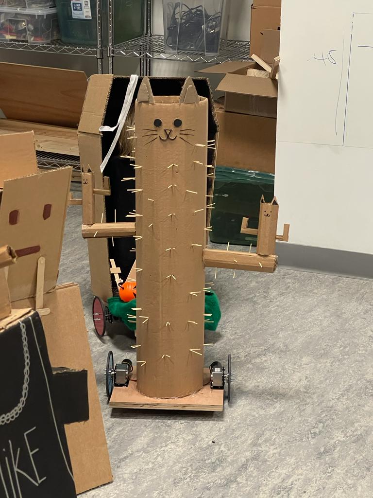
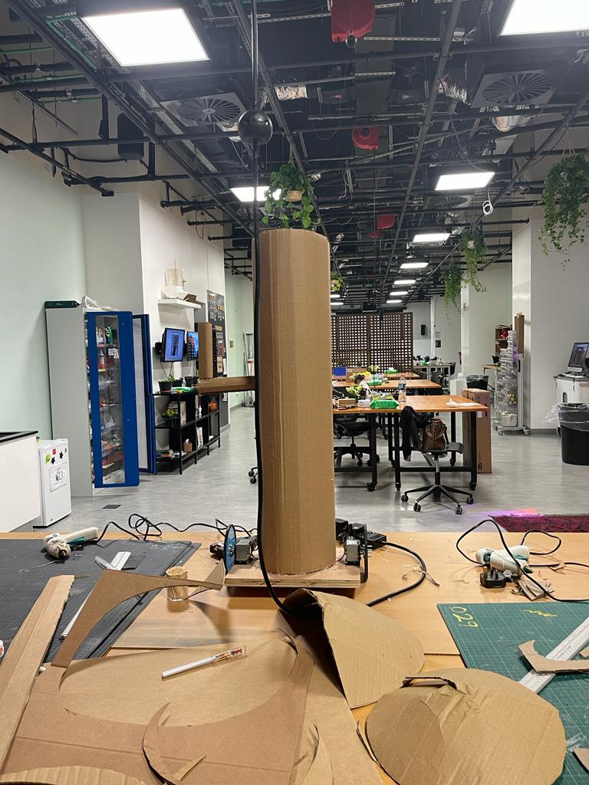
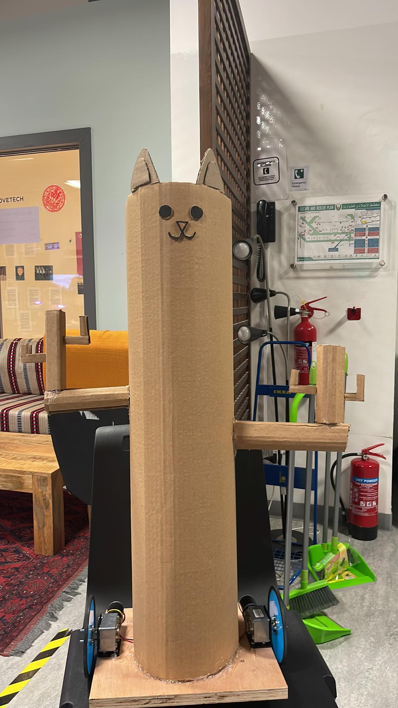
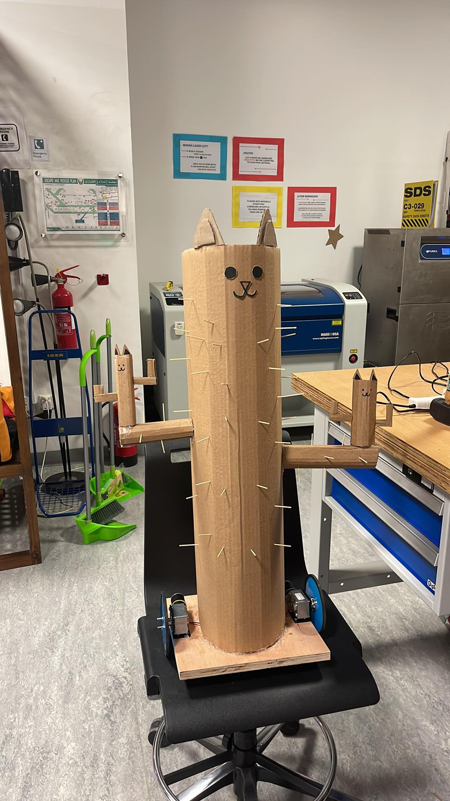

## Cactus Cat Bot
###### (Dhabia and I are in debate about whether cactus or cat should come first)

### Table of contents
1. [About the Cactus](#about)
2. [Images of the Final Product](#imagesFinal)
3. [Videos](#Videos)
4. [Images of Work in Progress + Plans](#imagesWIP)

### About the Cactus 

For this assignment, we had to create a body for the platform robots. Our concept revolved around making a cactus cat. We wanted to make a sturdy robot that could bump into people and things without breaking, and cacti are sturdy in their natural habitat. Another part of our plan was to add sliding hatch in the back, which would help us access the arduino and the electrical parts comfortably. The final product ended up looking as planned, but one thing that could be worked on is the opening at the top. Closing it would help protect the electronics just a bit better.

### Images of The Final Product 

### Videos 

[Here is a video of the cat cactus in action!](https://youtu.be/E3FCLbn6hOI)

### Pictures of Work in Progress + Plans 

### Remote Control Code

And we also wrote a program for it, so that we could control it with a controller. The basics of the code are that it takes the output values of the controller and converts it into movement and steering. I tried to make it as dynamic as possible, which resulted in something like this for the variables:

      // Acceleration
      int speed = int(rc_values[RC_CH2]);
      // int rawSpeed = 1500 - speed;                          // trigger pulled is 960, pushed is 2040
      int conSpeed = map(speed, 960, 2040, -255, 255);
      // Steering
      int turn = int(rc_values[RC_CH1]);
      int rawTurn = 1500 - turn;
      // steering: positive is left, negative is right
      int turnWeight = map(abs(rawTurn), 0, 540, 0, 0.75);
      int turnRight = 0;
      int turnLeft = 0;
      if (turn > 1510) {
        turnRight = 1;
      }
      else if (turn < 1490){
        turnLeft = 1;
      }

And taking these, I tried to write code that would take the variables and apply them dynamically:

    // move & steer
    if(1490 < speed && speed < 1510){
      analogWrite(pin1, 0); analogWrite(pin2, 0); analogWrite(pin3, 0); analogWrite(pin4, 0);  
    }
    else{
      // motor 1 - left side
      analogWrite(pin1, (-1)*conSpeed * (1 - (turnLeft*turnWeight)) * WEIGHT_LEFT );
      analogWrite(pin2, conSpeed * (1 - (turnLeft*turnWeight)) * WEIGHT_LEFT);
      // motor 2 - right side
      analogWrite(pin3, (-1)*conSpeed * (1 - (turnRight*turnWeight)) * WEIGHT_RIGHT );
      analogWrite(pin4, conSpeed * (1 - (turnRight*turnWeight)) * WEIGHT_RIGHT ); 
    }
